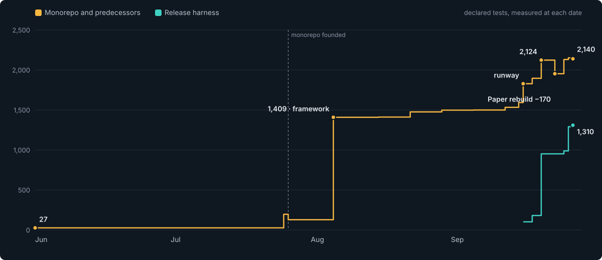
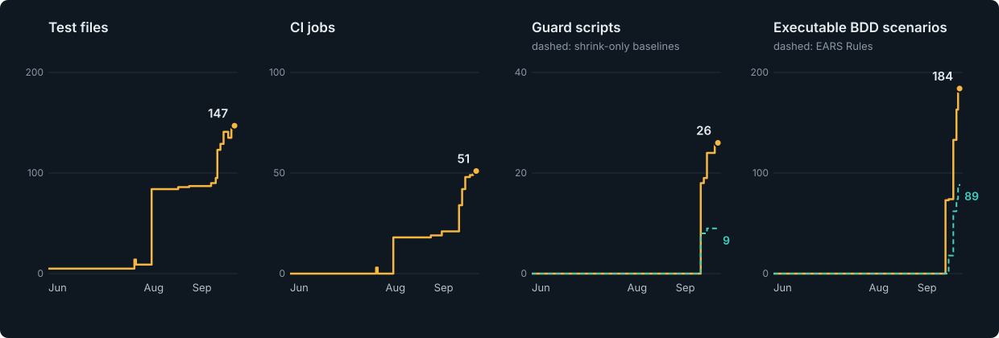

# How our testing grew

From 27 tests and no CI to a suite that is built to fail, June to September 2026.

This is the story and the reasons. For what each tier owns and how to run it, read
[TESTING-OVERVIEW.md](../TESTING-OVERVIEW.md); the long form is [TESTING.md](../TESTING.md),
and mutation testing has its own guide, [MUTATION-TESTING.md](../MUTATION-TESTING.md).

## Where we started

On 1 June 2026 the flagship reader had **no tests, no CI workflow and no Dockerfile**. Across
the whole ecosystem there were 27 tests, all in one side repository. That is normal for a
fast-moving open-source teaching tool, and it is what made every later change risky.

## Five steps, not a slope

The count did not grow evenly. It moved in steps, and each step answered a different question.

| When | Step | The question it answered |
|---|---|---|
| July | The reader's first tests and first workflow; the move to a monorepo | Can we test this at all? |
| 6 Aug | The testing framework: 27 to 1,409 declared tests in a week | How many tests can we have? |
| 17 Sep | The testing runway: negative fixtures, shrink-only baselines, tiers A to O, +236 tests in a day | Can these tests fail, and can the debt grow? |
| 19 – 21 Sep | Feature files bound to product code; EARS Rule ids and the audit gate | Do the requirements test anything? |
| 26 Sep | Honest coverage floors, mutation testing breaking at 90%, nightly mutation of every library module | Would a test notice if the code were wrong? |

Between the steps the count still grew, about 30 tests a week, because features now arrive
with their tests.

## The numbers

| | 1 Jun | 26 Jul | 6 Aug | 16 Sep | 21 Sep | 28 Sep |
|---|---:|---:|---:|---:|---:|---:|
| Declared tests | 27 | 196 | 1,409 | 1,593 | 2,124 | **2,140** |
| Test files | 5 | 14 | 84 | 95 | 141 | **147** |
| BDD scenarios bound to code | 0 | 0 | 0 | 0 | 74 | **184** |
| EARS Rules | 0 | 0 | 0 | 0 | 18 | **89** |
| CI workflows / jobs | 0 / 0 | 1 / 3 | 4 / 18 | 7 / 21 | 12 / 48 | **12 / 51** |
| Guard scripts | 0 | 0 | 0 | 0 | 24 | **26** |
| Shrink-only baselines | 0 | 0 | 0 | 0 | 9 | **9** |

1 Jun and 26 Jul sum the predecessor repositories; the rest is this repository's `main` at the
end of each day. Tests are declared `it(`, `test(` and `Deno.test(` calls, not pass counts.
[tools/measure.py](tools/measure.py) reproduces every column.

## The ideas worth keeping

These are the choices that made the difference. Each one is enforced by a check, not by
memory.

- **One owning tier per failure class.** If no tier owns a class of bug, it ships.
- **No tier without a negative fixture.** Every check ships with a deliberately broken input
  it must reject. A green check that has never been red proves nothing.
- **Debt can shrink, never grow.** Nine baseline files (`known-*.txt`,
  `ears-audit-baseline.txt`) list what is known to be wrong. A fix must delete its line, or a
  stale-entry check fails. They held 169 entries on 21 Sep and 167 on 28 Sep.
- **Floors only climb.** Coverage floors are measured over every source file and rounded
  down; a floor more than 2 points under the measured value fails as stale. Mutation floors
  work the same way, per module.
- **Rules first.** A behavioural change starts as an EARS requirement in a Gherkin `Rule`,
  proved red, then green, then audited. Rule ids link a requirement to its test, its changelog
  line and its release claim.
- **Test the built thing.** Headers, containers and accessibility are checked against the
  built image, not the source.
- **Judge every release against production.** The
  [release harness](https://github.com/tutors-sdk/tutors-release-harness) runs a candidate beside
  production and fails unless every observable difference is claimed. It found four production
  bugs no test had: the `/auth` 500 (#255), the unrecorded first visit (#285, #286), error
  reports lost on page unload (#353) and the sign-in page's missing title (#364).

## When the UI was rebuilt

The Paper rebuild (#313, 24 Sep) deleted 16 component test files and 2 end-to-end specs with
the old components, so the declared count fell by 170. On the same day BDD scenarios went from
74 to 133 and Rules from 18 to 62: the behaviour moved from per-component tests to Rules proved
by Playwright, one test per scenario. The count was back above its old level by 26 Sep.

That is the honest shape of a rebuild. The question to ask is not whether the count dipped,
but whether the behaviour stayed pinned.

## What is not done

- The global coverage floor is 58% of statements against a 90% target. Per-package floors are
  higher (the model package is at 98%).
- The Paper components have no component tests of their own yet.
- Tier F, authorisation, is planned (#77) but not built.
- None of the 55 pull requests merged since release 16.2.2 had an approving review. The CI
  gate, the ratchets and the harness stand in for review; they do not replace it.

Updated 28 September 2026. The wider story, including the release harness, is the
[evolution deck](tutors-revolution.md).
