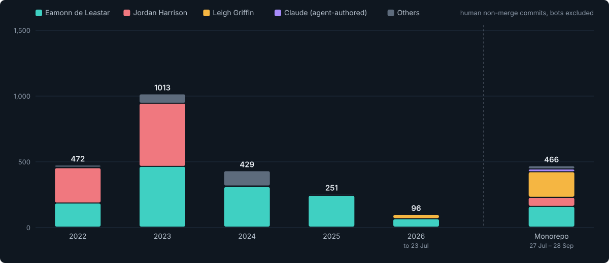
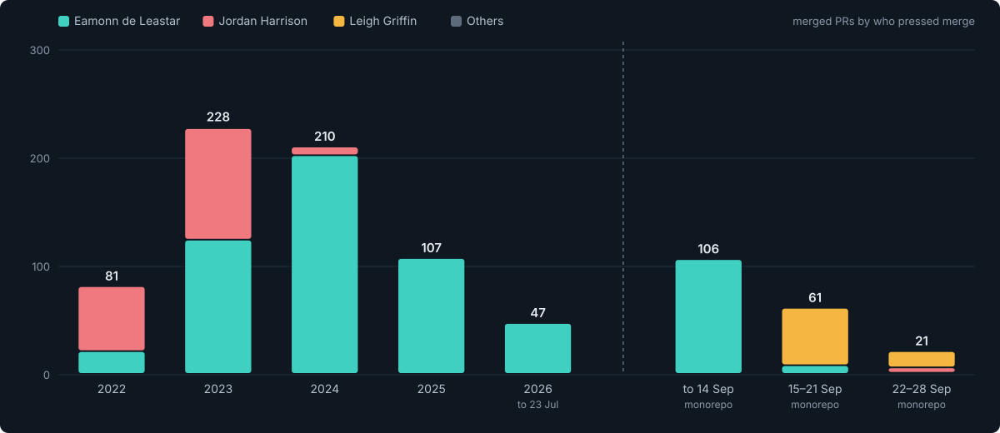
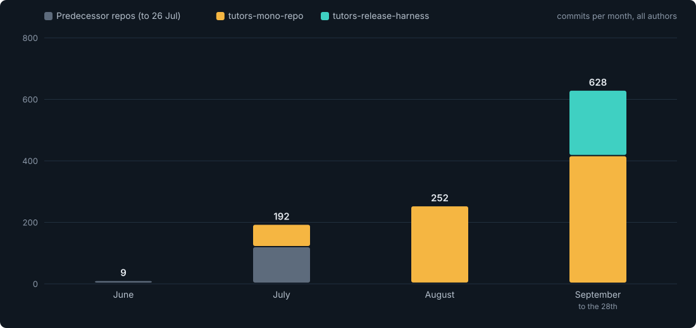
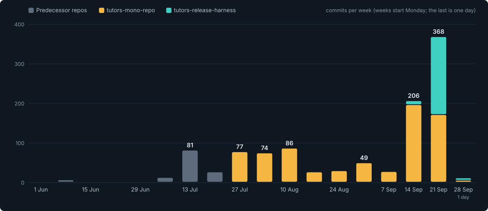
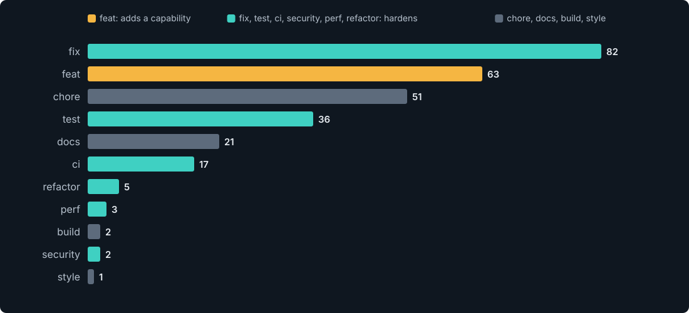
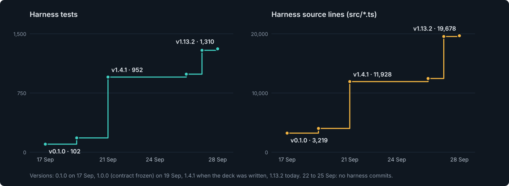
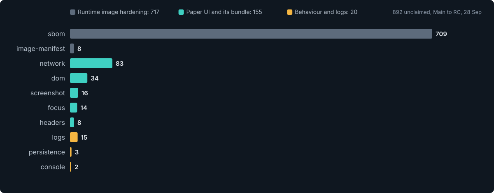

<!-- _class: lead -->
<!-- _paginate: false -->
<!-- _header: "" -->
<!-- _footer: "" -->

## Tutors · June – September 2026

# The (R)evolution of Tutors

### From a scatter of repositories to one hardened platform

**Leigh Griffin**  ·  Engineering review

<!--
Opening: this deck tells two stories at once. The revolution is what users can see: new content types, educator tools, a create wizard, and now a rebuilt interface. The evolution is what they cannot see: the engineering that makes the platform safe to change, safe to run, and boring to release. I am going to spend at least as long on the second as the first.

First written from data pulled on 21 Sep 2026; updated with data pulled from git and the GitHub API on 28 Sep 2026. The method and caveats are in the appendix.
-->

---

## The thesis

# Two stories, one platform

### The revolution you can see
Whiteboards, quizzes, notebooks, Panopto, a create wizard, educator locking, calendars, an Irish locale, a tour, and a rebuilt interface.

*Features people click on.*

### The evolution you can't
CSP and header contracts, signed images, a release harness that judges every candidate, shrink-only ratchets, structured logs, Prometheus, zero-downtime rollouts.

*Work people only notice when it is missing.*

> For every commit that adds a capability, there are **2.3** that fix, test, secure or harden the platform.

<!--
The 2.3 ratio comes from the commit-type slide later: fix + test + ci + security + perf + refactor = 145, against 63 feat (to 28 Sep). The 21 Sep version of this deck read 137 against 59; the ratio held through a week that shipped a whole new UI. Only the ~38% of commits with conventional prefixes are counted, so treat it as directional rather than exact.
-->

---

## Where we started

# June: several repos, one product

- **`tutors`**: the reader, plus a copy of most shared UI
- **`tutors-apps`**: catalogue, live and companion apps
- **`tutors-cli`**, **`tutors-time`**: separate release trains
- **`reference-course`** and **`reference-manual`**: content that tested the code
- Internal dependencies shipped through **JSR**, so a shared component change meant publish, bump, publish, bump

### The flagship reader on 1 June
- **0** tests
- **0** CI workflows
- **0** Dockerfiles
- `console.log` as the observability strategy
- Across the whole ecosystem: **27 tests**, all in one side repo
- A codebase audit on 13 Jul then found *14 trivial issues* in the first pass, plus leaks, invalid HTML and stray debug output

Measured from the `tutors`, `tutors-apps` and `tutors-cli` trees at their last commit before 1 June.

<!--
This is not a criticism; it is what a fast-moving open-source teaching platform looks like. The audit in mid-July, plus the first architecture document on 19 June, is what pointed at consolidation.
-->

---

## History

# The original repo, 2022 to 2026

2,261 human commits in `tutors-sdk/tutors`. In 2022 and 2023 two maintainers wrote almost everything. The second's last commit was on 10 Feb 2024; then one person carried the project. **The last bar is new: in September the second maintainer came back** and wrote the Paper UI rebuild.

<!--
Source: git log --all --no-merges on tutors-sdk/tutors, bots excluded, aliased emails folded into one identity per person (jouwdan uses three addresses, jordharr a fourth). 2026 stops at 23 July, the last commit before consolidation.

The last bar is the monorepo, 27 Jul to 28 Sep, non-merge commits on main: Leigh 194, Eamonn 158, Jordan 69, Claude 21, others 24 (Dependabot 11, Danny-Cert-AI 6, Hazey000 5, yuwk 1, Polly Labs 1). "Claude" is the git author on commits an AI agent wrote on Leigh's PRs; much agent-assisted work is committed under the human's own name, so treat that segment as a floor, not a measure.

The point of this chart is that a two-person model is not new. The project had it at its busiest, 1,013 commits in 2023, and then lost it. What follows is what happens when you have one, and what makes the next one durable this time. Jordan's return in September (67 of Jordan's 69 monorepo commits are from 22 Sep on) is the first test of that.
-->

---

## History, who pressed merge

# Merge rights narrowed to one person

From January 2025 until 14 September 2026, every merged pull request, 272 in a row across both repositories, was merged by the same person. In the week of 22 September, **three different people pressed merge** for the first time since 2024.

<!--
The chart counts "Merge pull request" commits by their git author, which is whoever pressed merge. That undercounts squash and rebase merges, most visibly in 2022 (81 here, 132 from the GitHub API's mergedBy). API totals per year for the original repo: 132, 230, 210, 107, 53 (to 23 Jul). Monorepo: 106 before 15 Sep, 61 from 15 to 21 Sep, 21 of the 22 merged from 22 to 28 Sep (#319 was squash-merged and has no merge commit).

Notice the last two bars. Merge duty first swung, 53 of 61 in the week of 15 September by the second maintainer. Then it spread: 22 to 28 September, Leigh 15, Jordan 5 (the Paper rebuild and its follow-ups), Eamonn 1. Three keyholders using their keys is new. Review is still not: see the later slides.
-->

---

## The risk

# What a single maintainer meant

<b>96%</b>of 2025 commits by one person (242 of 251)

<b>272</b>merged PRs in a row by the same person, Jan 2025 to 14 Sep 2026

<b>10 / 10</b>release PRs in the monorepo cut by that same person

- **Bus factor of one** for roughly two and a half years (Feb 2024 to Jul 2026)
- Two months in 18 with **no commits at all** (Aug 2025, Mar 2026): nothing merged, nothing released, nobody to notice
- Review, merge, release and the knowledge of why things are the way they are, **all in one head**
- No second pair of eyes: a mistake reached `main` unless the author caught it

> This is not a criticism of anyone. It is how most open-source teaching tools live, and it is the risk a hardening programme exists to remove.

<!--
The two silent months are from git log on the original repo: 2025-08 and 2026-03 have zero commits in the monthly histogram (Jan 2025 to Jun 2026). Some other months have only a handful.

The 10 of 10 release PRs: all merged PRs titled "release ..." in the monorepo were authored by the same person.
-->

---

## The consolidation

# 27 July: one repository

<b>4</b>SvelteKit apps: reader, catalogue, live, time

<b>24</b>packages: 18 Svelte, 6 JSR

<b>1</b>ingest service for live data

- `workspace:*` replaces publish-and-bump for anything internal
- One lockfile, one CI, one test root, one place to fix a cross-cutting bug
- Shared UI split into `ui-primitives`, `ui-navigators`, `ui-components`; shared concerns into `logger`, `metrics`, `rbac`, `privacy`, `a11y`, `i18n`, `runtime`
- ~100k lines tracked (excluding lockfiles and minified assets)

<!--
Consolidation is a hardening move in itself: a single place to enforce a rule is the precondition for every rule that follows.
-->

---

## The numbers

# 1 June to 28 September

<b>1,081</b>commits across the ecosystem (740 monorepo + 213 harness + 128 predecessor)

<b>378</b>pull requests (268 monorepo + 58 harness + 52 predecessor)

<b>195</b>PRs merged in the monorepo in 9 weeks; 23 of them since 21 Sep

<b>14 + 32</b>product releases (16.0.2 to 16.2.2) and harness versions (0.1.0 to 1.13.2)

<b>99</b>issues raised (96 monorepo, 3 harness)

<b>7</b>human contributors, plus Dependabot and an AI agent

<!--
The monorepo's git history begins on 27 July, so June and early July numbers come from the predecessor repos: tutors 90, tutors-apps 16, tutors-cli 1, reference-course 15, reference-manual 6, default branches, 1 Jun to 26 Jul. Those five sum to 128.

Monorepo and harness commits are git log on main (first parent plus merged branches). The 21 Sep edition counted 619 monorepo commits from a mid-day snapshot; end of day 21 Sep is 626, so the week since added 114.

PR counts are GitHub search totals. Of the 268 monorepo PRs: 195 merged, 49 closed without merging, 24 open (7 of them Dependabot from this morning). Harness: 58 PRs, 52 merged, 6 closed (Dependabot folded into a batch PR).

No product release has been cut since 16.2.2 on 18 Sep: main now carries the Paper UI, which is not yet claimed for release (Part 3). Harness versions are the 32 tags v1.0.0 to v1.13.2 plus 0.1.0 in package.json.

The seventh human is Jordan Harrison, back in September. The agent is Claude, credited as a git author on 21 monorepo and 18 harness commits.
-->

---

## Cadence

# Momentum built every month

June was quiet (9). July is the pivot: the audit and the move to a monorepo. September, to the 28th, outweighs June to August combined: 415 monorepo commits plus 213 in a release harness that did not exist before 17 September.

---

## Cadence, week by week

# Two record weeks, back to back

Week of 14 Sep: containers, Prometheus, OpenShift logging, the testing runway and the first harness. Week of 21 Sep: 368 commits, over half in the release harness, with the Paper UI landing in the middle.

<!--
Week of 21 Sep: monorepo 171, harness 197. The harness had 129 commits on 21 Sep alone (the 1.3.0 contract and the user guide), none from 22 to 25 Sep, then 74 from 26 to 28 Sep (Main to RC, the scorecard, and the Release Confidence build 1.8.0 to 1.13.2).

The last bar is one day, 28 Sep.

The point from the first edition still stands: the highest-throughput week (14 Sep) shipped the fewest user-facing features. The second week is the exception that tests the system: a UI rebuild of 253 files landed in the middle of it, and the harness is what tells us what it changed.
-->

---

## People

# A small team, a wider circle

| Contributor | Commits (all) | Non-merge | PRs opened |
|---|---:|---:|---:|
| Eamonn de Leastar | 318 | 158 | 60 |
| Leigh Griffin | 302 | 194 | 134 |
| **Jordan Harrison** (returned Sep 2026) | 75 | 69 | 10 |
| Claude (AI agent, on Leigh's PRs) | 21 | 21 | – |
| Dependabot | 11 | 11 | 54 |
| Danny-Cert-AI | 6 | 6 | 5 |
| Hazey000 | 5 | 5 | 2 |
| yuwk, Polly Labs | 1 each | 1 each | 2 (fork PRs) |

Good-first-issues, a devcontainer, a "first hour" that ends in a rendered course, and CODEOWNERS turned drive-by contributors into repeat ones, and let a maintainer away for two and a half years land a 253-file rebuild in their first week back.

<!--
Monorepo main, 27 Jul to 28 Sep. Commit counts are git author names; "lgriffin" is a second identity for Leigh folded in. PR counts are by GitHub login: the 21 Sep figures plus PRs opened since (Leigh 19, Jordan 10 from #313 on, Eamonn 1, Dependabot 7, Danny-Cert-AI 1).

Since 22 Sep Leigh's own name is on no non-merge monorepo commits: the work on Leigh's 19 PRs was written by Claude sessions that Leigh directed and merged, and is credited either to Claude or, in the harness repo, to Leigh. The harness is 213 commits: Leigh 124 non-merge, Claude 18, the rest merges. Jordan's branches are named codex/…, so the rebuild was agent-assisted too. None of this changes who is accountable for a merge; it does change what "commits per person" measures.
-->

---

<!-- _class: tight -->

## Since the first edition, 1 of 2

# 21 to 28 September: the product

| PR | What it did | Why it matters |
|---|---|---|
| **#313**, #331 | The Paper UI, then every app onto it | The first visible change since 16.2.2, by a returning maintainer |
| **#317** | Row-level security on **every** public table | 14 tables were open to the browser's anon key |
| **#353** | Error reports sent on page unload reach the database | A silent **400** in production, found by the harness |
| **#364** | The sign-in page gets a `<title>`; four accessibility fixes claimed | Found by the harness; 27 minutes from PR to merge |
| *#332, #339, #341* | *Home pages; ui-primitives kept off the data layer; xAPI and Open Badges* | *Open, waiting on review or on the #320/#327 data seam* |
| *#338, #329, #294, #152, #266* | *Five older PRs refreshed onto main and made green* | *Left open for a human reviewer* |

---

<!-- _class: tight -->

## Since the first edition, 2 of 2

# 21 to 28 September: how it ships

| PR | What it did | Why it matters |
|---|---|---|
| #333, #335, #336 | Honest coverage floors; mutation at 93.6%, breaking at 90; nightly mutation | "Can these tests fail?" is measured every night |
| #349 | The changelog generated from merged PRs and their EARS Rules | Changelog, Rule and claim trace to each other by construction |
| #351 | Sign and attest an image digest **before** any tag points at it | No window where a tag names an unsigned image |
| #352 | A bounded `devalue` override for GHSA-9rgm-9g3h-6x36 | Main's CI was red on every push; fixed at the cause |
| **#355** | `pnpm release:candidate`, `release/deployed.json`, the release **SOP** | A release is now twelve written steps and one command |
| #350, issues #342–#348 | The OpenShift and AWS migration plan as EARS-tracked issues | Leaving Netlify and Supabase has a checkable route |

Plus, in the release harness, 36 merged PRs taking it from 1.4.1 to 1.13.2 (Part 3).

<!--
Chosen for the story, not completeness: 23 monorepo PRs merged 21 to 28 Sep. Italic rows are still open.

#317: "Supabase flagged tutors-prod critical (rls_disabled_in_public): 14 tables had RLS off, so the anon key in every browser could read, change and delete them. This is the SQL applied by hand to prod on 24 Sep 2026, recorded as a migration so every other database matches." That is the most consequential fix of the week and nobody outside the team would ever see it.

#352 was found while refreshing the five older PRs: every one of them was red for the same reason, which was main, not them.

#364: opened 07:18 UTC, merged 07:45 UTC, 28 Sep.
-->

---

<!-- _class: divider -->
<!-- _paginate: false -->

## Part 1

# The revolution you can see

New capabilities since June

---

<!-- _class: tight -->

## New capabilities

# What learners and educators got

### Richer content
- **Jupyter notebooks** as a first-class type, with Pyodide execution and solution hiding
- **Whiteboards** (Excalidraw), then real-time collaboration
- **Quiz** learning objects with scored results and retake
- **Panopto** video, **Marp** slides, **Mermaid** diagrams

### Educator control
- **RBAC**: educator role via `enrollment.yaml`
- **Content locking** by topic, with an educator panel
- **Calendar** with week numbers and assessments

### Authoring
- **Create wizard** and `@tutors/tutors-create` scaffolder
- `course.json` export and import to pre-fill the wizard
- Optional calendar, enrolment, `.gitignore` and README seeding
- **Tutors Lite** brought into the monorepo

### Reach
- **Irish (ga)** locale; accents restored in de, es, fr, it
- Guided onboarding **tour**, toast notifications
- ARIA and keyboard work across the UI
- **Time** app migrated in, **Live** stats and heat map in flight

---

## Release by release

# Fourteen releases in eight weeks

| Version | Headline |
|---|---|
| 16.0.2 – 16.0.4 | Monorepo cut over; Tutors Time migrated; whiteboard learning object |
| 16.1.1 | RBAC educator role, content locking, new calendar format |
| 16.1.2 – 16.1.3 | Panel-only units fixed; create wizard gains calendar and enrolment |
| 16.1.4 – 16.1.6 | Locked content excluded from walls; TOC locking; navigation-loop fix |
| 16.1.5 | Panopto support |
| 16.1.8 | Create wizard import/export; logger flush and cleanup |
| 16.2.0 | Liveness probe and Prometheus `/metrics` |
| 16.2.1 | Quiz learning objects; the `/auth` 500 fix; runway-pinned fixes |
| 16.2.2 | Card summaries render markdown; translations fixed |
| *next, unreleased* | *The Paper UI across all four apps; RLS on every table; search that ranks and highlights* |

<!--
Notice how many of the rows are half fix. Locking alone took four releases to make right, because each fix was found by a user or a test that we then kept.

The last row is what main carries today. It has not been released: 16.2.2 (18 Sep) is still production, and the harness will not pass main until its differences are claimed (Part 3).
-->

---

<!-- _class: tight -->

## The new UI

# Paper: one interface for four apps

- Tutors rebuilt on the **Paper design system**: shared tokens for colour, spacing, borders and type across Reader, Catalogue, Live and Time
- New **sidebar, course tree, calendar** and compact menus; cards, search, quizzes, notebooks, media and whiteboard restyled
- **Dyslexia** fonts, reading spacing and palette
- **Phones and tablets**: two-up cards, a header that scrolls away
- Search matches **every word**, ranks titles first, and **highlights** the match (Rules 0056–0058)

### Why
The four apps had grown **inconsistent navigation, controls and layouts**. One design system means one place to fix a menu, and one look for a learner moving between apps.

### Who
**Jordan Harrison**, who co-wrote Tutors in 2022–23 and whose last commit before this was in February 2024. PR #313 was Jordan's first contribution to the monorepo.

<!--
Sources: PR #313 description ("replacing inconsistent navigation, controls and content layouts with shared design tokens across Reader, Catalogue, Live and Time while preserving the learning flows"), #318 (mobile), #330 (headers and mobile navigation), #319 (one home for every navigation row), #331 (time, catalogue and live onto Paper and the reader's UX patterns: every string through i18n, 98 keys in all six locales, breadcrumbs, loading and empty states).

"First contribution" is the harness's own flag in its change-risk table: it knows no earlier monorepo PR by that login.
-->

---

<!-- _class: tight -->

## The new UI, in five PRs

# From rebuild to every app, in five days

| When | PR | What landed | Size |
|---|---|---|---:|
| 24 Sep | **#313** | Rebuild Tutors with the Paper design system | 253 files, +5,903 / −5,878 |
| 24 Sep | #316 | Whiteboard loads its scene, follows dark mode, matches Paper | 7 files, +225 / −93 |
| 24 Sep | #318 | Phones and tablets fit: two-up cards, scroll-away header | 23 files, +363 / −61 |
| 26 Sep | #330 | Course headers, mobile navigation, content spacing | 20 files, +122 / −75 |
| 28 Sep | **#331** | Time, Catalogue and Live onto Paper and the reader's UX patterns | 89 files, +1,390 / −1,861 |

### What it cost the evidence
- **−170 declared tests** on 24 Sep: 16 component test files and 2 e2e specs for the old UI were deleted with it
- The **harness journeys** had to learn the new shell (harness #23, #31)
- **155** unclaimed UI differences on the Main-to-RC run

### What it gave back
- BDD scenarios **74 → 133** and EARS Rules **18 → 62** by the same day
- Four **accessibility violations fixed** on production pages, found by the harness and claimed in #364
- The test count was back above its pre-rebuild level **two days later** (2,131 on 26 Sep)

<!--
Test counts from the measurement method in the appendix, at the last first-parent commit on main each day: 2,124 (21 Sep), 1,954 (24 Sep), 2,131 (26 Sep), 2,140 (28 Sep). Deleted with #313: tests/components/{runes,ui-components,ui-navigators,ui-primitives}/* (16 files), apps/reader/tests/e2e/smoke.spec.ts, tests/e2e/accessibility.spec.ts.

This is the honest shape of a rebuild: tests written against the old components go with them, and the question is whether behaviour is still pinned. Here it is pinned at a higher level (Rules and scenarios) rather than per component. Component tests for the Paper primitives are the next step on the testing ramp.

The whiteboard fix #316 superseded Leigh's #304; #317 (RLS) landed the same day but is a security change, covered in Part 2.
-->

---

<!-- _class: divider -->
<!-- _paginate: false -->

## Part 2

# The evolution you can't see

Engineering hardening and resilience

---

## The proportion

# More fixing than building

Monorepo, conventional-prefix commits only (283 of 740, to 28 Sep). fix + test + ci + security + perf + refactor = **145**, against **63** feat.

<!--
Be upfront: the early commits in the monorepo were not prefixed, so this is a subset, and the Paper rebuild's own commits mostly carry no prefix. The direction is unambiguous though: fix is the single biggest bucket and test is bigger than most people would guess. The release harness is not counted here; its commits are overwhelmingly features of the harness itself.
-->

---

<!-- _class: tight -->

## The map

# Nine pillars of hardening

**1 Security**
Sanitisation, CSP, header contract, secrets policy

**2 Supply chain**
Dependabot, CodeQL, Scorecard, zizmor, Trivy, cosign, SBOM

**3 Testing**
Seven tiers, the runway, BDD, fuzz, mutation

**4 Observability**
Structured logs, health, Prometheus, Grafana

**5 Containers**
Runtime config, non-root, minimal, scanned

**6 Kubernetes**
Kustomize, OpenShift, kind, probes, PDB

**7 Release engineering**
rc, promote-not-rebuild, claims, migrations

**8 Architecture guardrails**
Dependency rules, knip, API surface, types

**9 Inclusion and privacy**
Accessibility, i18n, GDPR

---

<!-- _class: tight -->

## The timeline

# Hardening, dated

| When | What landed |
|---|---|
| 19 Jun – 15 Jul | Architecture draft; mutation testing; codebase audit; **knip**; alt text; memory-leak and debug-log sweep |
| 27 Jul | Monorepo founded |
| 2 – 6 Aug | Testing framework; **HTML sanitisation**; **CSP**; JWT shortened; Zod env validation; **CI pipeline**; CVE fixes; fuzz tests |
| 12 – 15 Aug | **138 type errors cleared**; SECURITY.md; secret minimum 8 to 32; **privacy package**; ARIA; `/healthz`; **structured logging** with correlation IDs |
| 19 – 24 Aug | API surface tracking; ESLint; **error aggregation** and deep health checks |
| 30 Aug – 2 Sep | **zizmor**, OpenSSF **Scorecard**, **CodeQL** |
| 14 – 16 Sep | **Containers**, OpenShift logging, **Prometheus** and Grafana |
| 17 Sep | **Testing runway**; pinned bugs fixed; **release harness** built |
| 19 Sep | **Signed multi-arch images**, K8s Route/Ingress, release dispatch, auth smoke |
| 21 Sep | **Digest pins**, promote-the-rc, migration checks, EARS rule audit, **Grafana learning insights**, harness verdict on the release PR |
| 24 – 26 Sep | **RLS on every table** (#317); Paper UI; **honest coverage floors**, **nightly mutation** (#333–#336) |
| 27 – 28 Sep | **Sign before tag** (#351); generated changelog (#349); **SOP** and `release:candidate` (#355); **Release Confidence** in the harness |

---

## Pillar 1

# Security by default

- Notebook cells and Marp slides **sanitised**; an SSR bypass closed (#19)
- **CSP** headers, iframe domains restricted, **JWT lifetime cut** (#23)
- `AUTH_SECRET` minimum **8 to 32** characters (#55)
- **Zod validation** of every environment variable at boot (#20)
- `SECURITY.md`: 48h acknowledgement, 90-day disclosure (#43)
- GDPR: `@tutors/privacy` and a **data inventory** matched to the real schema (#57, #134)
- **Row-level security on every table** (#317): 14 were open to the anon key

### The header contract
Every response from every app must carry:

`X-Frame-Options` · `X-Content-Type-Options` · `Referrer-Policy` · `Permissions-Policy` · `Strict-Transport-Security` · `Content-Security-Policy`

Checked against the **built image**, not the source. A `mutating-routes` list is audited too. Known gaps sit in a file that **may only shrink**.

---

<!-- _class: tight -->

## Pillar 2

# Supply chain you can trust

### Watching
- **Dependabot**, grouped, minor and up only (#54, #72, #187)
- **CodeQL** static analysis (#142)
- **OpenSSF Scorecard**, with a badge (#127, #140)
- **zizmor** audits our own GitHub Actions (#117)
- Least privilege: an unused `pull-requests: write` removed (#126)

### Acting
- Unmaintained KaTeX plugin **replaced**, closing 3 CVEs (#28)
- Vulnerable `cookie` **overridden** (#27)
- `prom-client` deprecated upstream, so we moved to `@prometheus-io/client`
- **Trivy** gate on every image: HIGH and CRITICAL with a fix fail the build
- **cosign** keyless signatures and **SPDX SBOM** attestation

> The tooling that guards the code is itself audited: zizmor reads our workflows the way CodeQL reads our source.

---

## Pillar 3

# Testing: from 27 tests to 2,140

Measured from git history at each date. The flagship reader had **no tests and no CI** on 1 June; the only tests in the ecosystem were 27 in one side repo. The release harness (teal) carries **1,310** more of its own.

<!--
Every point on this chart was measured by checking out that commit and counting test declarations (it, test, Deno.test), so the shape is real rather than a narrative. Fixtures for the checks themselves are excluded.

Three steps rather than a slope: the July pivot when the flagship got its first tests and its first workflow; the testing framework that landed on main on 6 August (27 to 1,409 in a week, most of it from the framework work started on 2 August); and the testing runway on 17 September (+236 tests in one day, plus 18 guard scripts and 7 shrink-only baselines).

Between the steps the count still grows, roughly 30 tests a week: features now arrive with their tests.

New since the first edition: the dip on 24 Sep is the Paper rebuild deleting the old UI's component tests (−170), recovered by 26 Sep through the testing ramp. The harness line is the harness repo's own suite, counted the same way; it is not part of the 2,140.

The 27 Jul step down (196 to 129) is the switch from summing the predecessor repos to measuring the new monorepo, which did not bring every predecessor test across on day one.
-->

---

## Pillar 3, the shape

# Every dimension moved, in steps

Test files 5 to 147 · CI jobs 0 to 51 · guard scripts 0 to 26 (dashed: 9 shrink-only baselines) · executable BDD scenarios 0 to 184 under 89 EARS Rules (dashed).

<!--
Note the last panel: the 24 feature files existed from early August but were documentation only. Binding them to product code on 19 September is what turned them into executable acceptance tests, and it is what found the search, sort and logger bugs later in the deck. Since then scenarios have gone from 74 to 184, and the Rules that name them from 18 to 89: every behavioural PR in the last week arrived as Rules first.
-->

---

<!-- _class: tight -->

## Pillar 3, zero to now

# The milestones

| | 1 Jun | 26 Jul | 6 Aug | 16 Sep | 21 Sep | 28 Sep |
|---|---:|---:|---:|---:|---:|---:|
| Declared tests | 27 | 196 | 1,409 | 1,593 | 2,124 | **2,140** |
| Test files | 5 | 14 | 84 | 95 | 141 | **147** |
| Test areas under `tests/` | 0 | 3 | 7 | 8 | 17 | **15** |
| BDD scenarios written / executable | 0 / 0 | 0 / 0 | 115 / 0 | 115 / 0 | 74 / 74 | **184 / 184** |
| EARS Rules | 0 | 0 | 0 | 0 | 18 | **89** |
| CI workflows / jobs | 0 / 0 | 1 / 3 | 4 / 18 | 7 / 21 | 12 / 48 | **12 / 51** |
| Guard scripts | 0 | 0 | 0 | 0 | 24 | **26** |
| Shrink-only baselines | 0 | 0 | 0 | 0 | 9 | **9** |

> Quantity came first (6 Aug). Then the question changed from *how many tests?* to *can these tests fail, and can the debt grow?* That is the 17 September runway.

1 Jun and 26 Jul sum `tutors`, `tutors-apps` and `tutors-cli`; the rest is the monorepo. Test areas exclude helper folders (`support`, `mocks`). 21 Sep is now measured at end of day; the first edition's mid-day snapshot read 2,087 / 140 / 11 workflows / 46 jobs / 8 baselines.

<!--
Honest reading: the August jump proves the framework, not the quality. The framework PR was titled "needs detailed review", and a coverage-threshold PR on 12 August lowered the floor to match reality. The runway is the answer to that: negative fixtures, ratchets, and binding the BDD files to code.

Test areas fell from 17 to 15 because the Paper rebuild removed tests/components (and one other area) with the old UI. The week's growth is in Rules and scenarios, not in raw test count: the test count is roughly flat, 2,124 to 2,140, while the Rules went 18 to 89.
-->

---

<!-- _class: tight -->

## Pillar 3, the strategy

# A testing strategy that can fail

<b>2,140</b>declared tests across 147 files, up from 27 on 1 June

<b>184</b>BDD scenarios in 32 feature files under 89 EARS Rules, bound to product code

<b>26</b>check scripts guarding structure, security, perf, coverage, mutation and release

**Seven tiers**: unit · BDD · component · integration · Playwright e2e · contract snapshots · fast-check fuzz. The **runway** (17 Sep) added architecture, suite-health, completeness, observability, conformance, security and performance tiers.

- Mocks replaced with **real implementations and data-driven doubles** (#17)
- **Honest coverage floors** (#333) over every source file: global 58 / 51 / 58, per package up to 98; a floor 2 points under measured fails as stale, so floors only climb
- **Mutation** (#335, #336): 12 modules at **93.6%**, breaking under 90; every library module mutated **nightly**
- Nightly: **k6 load**, **Lighthouse**, **timezone matrix**, **generator corpus**, **mutation**

---

## Pillar 3, the clever part

# Ratchets and negative fixtures

### Shrink-only baselines
Nine baseline files record what is *known wrong*:

`known-violations` · `known-knip` · `known-manifest-drift` · `known-gaps` · `known-findings` · `known-response-gaps` · `known-timezone-failures` · `a11y-known-violations` · `ears-audit-baseline`

A fix **must delete its line**, or a stale-entry check fails. Debt can be paid down; it cannot grow. **Coverage and mutation floors** now obey the same rule, upwards.

### No tier without a way to fail
Each new check ships with a **negative fixture**: a deliberately broken input the check must reject.

A green check that has never been red proves nothing.

The **`ci-success`** job aggregates every gate into one required status.

<!--
This is the idea I would most like people to steal. It turns "we should clean this up" into a mechanism. The counter can only go down, and every check has proven it can go red.
-->

---

<!-- _class: tight -->

## Pillar 3, the payoff

# What the tests found

| Bug | Fix |
|---|---|
| Anonymous mode without an auth secret **returned 500 on every page** | #252 |
| A course that does not exist rendered **"500 Server Error"** (now 404, and an unreachable host is told apart) | #274, #293 |
| Search hit in one-line content **came back with no text** | #270 |
| `indicesOf` drifted, breaking **fence and language detection** | #271 |
| Learning object with `order: 0` **sorted last** instead of first | #272 |
| Logger **dropped the Supabase error message** | #273 |
| First visit **not counted** when the RPC returned no rows | #286 |
| Card summaries showed raw markdown until opened | #263 |
| UTC and generator bugs; catalogue 404; undeclared deps; a11y and reduced-motion gaps | #253 – #255 |

Each was found by a tier written to prove it could fail, and each fix ships with the test that found it.

---

## Pillar 4

# You cannot fix what you cannot see

- **Structured JSON logs**: app, hostname, pid, level from `LOG_LEVEL`
- **One line per request**: method, route, status, duration, `requestId`
- Incoming `x-request-id` honoured, echoed back; **slow (>2s) warns**, 5xx errors
- **Error aggregation** table in Supabase for UI errors (#102)
- **`/healthz/live`** (cheap, no dependencies) and **`/healthz`** (checks Supabase) on all four apps
- ESLint **`no-console`**; a test keeps variable data out of log messages (#287, #297)

- **Prometheus `/metrics`** in every app via `@tutors/metrics`
- Route label is the **route id, never the raw path**, so scanner traffic cannot create unbounded series
- Optional bearer token on `/metrics`
- **Grafana**: infra alerts, plus a **learning-insights** stack reading Supabase through a read-only role on reporting views (#135)
- **ServiceMonitor** as a Kustomize component
- Log and metric **shape frozen** so A/A runs compare cleanly (#283)

---

<!-- _class: tight -->

## Pillar 5

# The container that was never built

PR #109 looked done. It could not actually build.

### Found by building, not reading
- Config read via `$env/static`: baked into the image, so CI only passed with a copied `.env.example`. **Moved to `$env/dynamic`**: one image, every environment.
- Supabase client created at import threw during SvelteKit's `analyse`. **Made lazy.**
- Workspace deps in `dependencies` made a **1.1 GB** image. **Moved to devDependencies**: Vite inlines them.
- Catalogue and live used **undeclared** Tailwind plugins that only resolved by hoisting accident.

### The runtime image
- Non-root **UID 1001, GID 0**: works with OpenShift's arbitrary-UID model
- Nothing writable in the image; only a bounded `/tmp` at runtime
- `apt-get upgrade`, then **npm, npx, corepack and yarn deleted**: they are what scanners flag first
- OCI labels: revision, version, source
- **Reproducible**: build pinned to the commit time so two builds of one commit answer identical headers

---

## Pillar 6

# Deployment that assumes failure

### Kustomize, built to be composed
- `base` + four app **overlays**
- **Components**: Route (OpenShift), Ingress, ServiceMonitor
- **Variants**: `openshift` and `kind`
- `pnpm check:k8s` runs kustomize and policy checks in CI

### Pod hardening
`runAsNonRoot` · seccomp profile · **all capabilities dropped** · no privilege escalation · **read-only root filesystem** · bounded `/tmp` · memory limits

### Resilient rollout
- `maxUnavailable: 0`: capacity never dips during a rollout
- **PodDisruptionBudget**, `minAvailable: 1`
- **startup**, **liveness** and **readiness** probes, each with a distinct job
- Liveness never touches Supabase, so a database blip **cannot restart-loop** the fleet

### Guards
- Overlay tag **must equal** the root version
- Overlays **pinned by digest** (#298)
- Random-UID, read-only-root container check

---

<!-- _class: tight -->

## Pillar 7

# Ship what you tested

<b>1 Tag</b>vX.Y.Z-rc.N cut from the merged commit

<b>2 Build</b>multi-arch, Trivy-scanned, cosign-signed, SBOM attached

<b>3 Judge</b>release harness compares rc with production

<b>4 Promote</b>final tag re-tags the <em>judged digest</em>. No rebuild

<b>5 Deploy</b>digest-pinned; harness checks the deployed digests against its record

- Images live at `quay.io/tutors-sdk/tutors-<app>`; `image-build.yml` is the **signing identity**
- **Promote, don't rebuild** (#303): the bits that passed are the bits in production
- `/version` answers build identity; commit kept **out of** `/_app/version.json` so builds stay deterministic
- **Release claims**: each changelog entry names the artefacts it expects to move (19 now, from `dom`, `headers` and `axe` to `sbom`, `vulns` and `runtime`). Anything else that moves is a regression (#280, #300, #308, #309)
- **Migration checks**: expand/contract discipline enforced on SQL (#300)
- The harness **verdict is posted on the release PR**; digests, Rules and repeat runs travel with the dispatch (#310, #311)
- **Signed before tagged** (#351); changelog **generated** from PRs and Rules (#349); `release:candidate` and `deployed.json` (#355). The judge in step 3 is Part 3

---

## Pillar 8

# Guardrails on the architecture

### Found in the 14 Sep architecture pass
- Cycles: `course → themes`, `themes → community`, `rbac → community`
- `decorateCourseTree` forked and already diverged
- Five time-analytics components duplicated across two apps
- A root `check` script that failed and a package whose tests never ran

### Now enforced
- **Dependency rules** test with a shrink-only violations list (#228 removes the first)
- **knip** flags unused code and dependencies
- **Manifest parity** across apps
- **API surface reports** for JSR packages, diffed in CI (#93)
- 138 type errors cleared (#37); type checks **blocking** (#269)
- ESLint and `no-console` (#92, #287)

---

## Pillar 9

# Inclusive and private by design

### Accessibility
- ARIA across the UI (#82)
- **axe** audits run against built images in CI; a flaky colour-contrast check traced to a hover animation and fixed at the cause (#257)
- Reduced-motion respected; search focus fixed (#253)
- Quiz options are a WAI-ARIA **radio group** with roving tabindex

### Language and privacy
- **Irish** added by a contributor; accents and umlauts restored in German, Spanish, French and Italian
- Translation **completeness** is a test, with a baseline that only shrinks
- **`@tutors/privacy`** package and a documented **data inventory**
- Quizzes are stated to be a formative self-check: answers held in memory, never recorded (#302)

---

<!-- _class: tight -->

## Resilience at runtime

# What happens when things go wrong now

| Failure | Before | Now |
|---|---|---|
| Supabase unreachable | Pages break, pods might restart | Readiness fails, **liveness stays green**, no restart storm |
| Lock store throws | Unhandled rejection on every visit | Contained; page renders |
| Course does not exist | "500 Server Error" | **404**; unreachable host reported distinctly |
| Anonymous mode, no auth secret | 500 on every page | Boots cleanly in anon mode |
| Scanner hits random URLs | Unbounded metric labels | Labelled `unmatched`, bounded series |
| Heavy libraries (KaTeX, MathJax, Marp, Mermaid) | Loaded eagerly | **Loaded on demand** (#256) |
| A rollout | Capacity can dip | `maxUnavailable: 0` and a PDB |
| A bad release | Found by users | Found by a **harness**, before promotion |
| A UI error | Swallowed | Logged and aggregated (#102, #173) |

---

## The pipeline

# From one workflow to twelve

<b>12</b>workflows (none on 1 June, one by late July)

<b>51</b>CI jobs across them

<b>4</b>cadences: PR, nightly, release candidate, release

**Every PR (11 jobs):** build and test · platform conformance · container smoke (plus fixtures) · dependency audit · e2e stack · bundle budgets · generator diff · EARS audit · CLI tests · `ci-success`

**Nightly:** contract snapshots · suite health · e2e no-retry · timezone matrix · Lighthouse · k6 load · generator corpus · **mutation** · report

**Release candidate (10):** lint and typecheck · unit and BDD · contract · fuzz · CLI · build · dependency audit · cross-browser e2e · artifact regression · report

**Plus:** release testing, CodeQL, Scorecard, zizmor, image build, release dispatch, release claims, **harness report**, deploy verify

---

## Spec-first

# Requirements as executable rules

- Every behavioural change starts as an **EARS requirement**, written as a Gherkin `Rule`
- Prove it **red**, implement, prove it **green**, then run the EARS audit
- Rule ids link requirements to **release claims**, so a changelog line, a test and a claim trace to each other (#301, #308)
- Scenarios that could not be executed were retired into `guides/specifications/`; the 74 that remained on 21 Sep are **184** now, all bound to real code, under **89 Rules**
- Rule ids are **reserved in blocks** per workstream (0110 testing, 0130 unification, 0206 release confidence, 0216 accessibility…) so parallel work never collides
- Tier O flags Gherkin keywords the parser silently drops, so a feature file cannot quietly test nothing

> The feature files used to be documentation. They are now the acceptance test.

<!--
This slide came from a specific discovery on 17 Sep: all 24 feature files were documentation-only. Binding them to product code found the search, sort and logger bugs on the earlier slide.
-->

---

<!-- _class: divider -->
<!-- _paginate: false -->

## Part 3

# The release harness

Catch the regression before it ships, not after

---

<!-- _class: tight -->

## Why it exists

# Every difference claimed, or the line stops

Tests prove what someone thought to check. A release also changes what nobody thought to check: a header, a console error, a focus order, a package in the image.

> **Is every observable difference between this candidate and production one somebody intended?**

- Candidate **beside production**, the **same scripted traffic** through both, everything visible diffed
- Intended differences are **claimed** in `release/claims.yaml`, by changelog entry or EARS Rule
- Anything else is **unclaimed**, and **fails the release**

### Why a separate repository
It consumes the monorepo's **signed images** and knows nothing about their source, so it can compare any two tags and **cannot be quietly weakened by the PR it is judging**.

It verifies every image's cosign signature, and every report says where each side came from.

<!--
The README's sentence: "Its job is not to prove the candidate is identical to production (a release should differ) but to prove that every observable difference is claimed, and that nothing else moved."

The shift this represents: from "did the tests pass?" to "do we know everything that changed?" The first is a question about the tests. The second is a question about the release.
-->

---

<!-- _class: tight -->

## How it works

# A judge that must earn the right to fail

<b>1 A/A</b>Production against itself, nightly. Measures noise; the gate may only fail with a <strong>clean A/A under 7 days old</strong>

<b>2 A/B</b>Candidate beside production, same journeys, <strong>3 to 5 runs</strong> for timing statistics

<b>3 Capture</b>DOM, screenshots, focus order, axe, console, network, headers, logs, metrics, persistence, SBOM, image manifest…

<b>4 Normalise</b>Masks remove known noise: dates, request ids, hashed asset names. <strong>25 masks</strong>, each one a chosen blind spot

<b>5 Judge</b>Every hunk matched against the claims. Unclaimed means <strong>FAIL</strong>

### It must prove it can fail
**Ten planted faults**, each a candidate image with a deliberate regression it must catch:

`dropped-header` · `route-500` · `console-error` · `dom-note` · `missing-alt` · `slow-ssr` · `anon-write` · `focus-order` · **`base-swap`** · **`added-package`**

### It must prove it is not flaky
- A journey that fails **on both sides** no longer counts as a clean A/A (#22)
- A mask that **never fires** costs points: it is a blind spot to delete
- The noise count has a **ratchet**: it reached 0 on 27 Sep and must stay there

<!--
Built 17 Sep in seven phases (H0 to H6) with eight mutants; the two new ones (base-swap, added-package) change what the image is rather than what a browser sees, and are caught by the image-manifest and SBOM artefacts.

Substrates: Docker compose, an edge proxy with k6, kind with restricted Pod Security. Stubs for GitHub-shaped identity and Supabase-shaped persistence. Six journeys: reference course reads, student signs in, catalogue loads, and so on. The README's principle: power comes from breadth of capture per journey, not from the number of journeys.

Noise figures from the noise branch, 27 Sep 14:44 UTC: count 0, 25 masks (review limit about 40), 3 silent.
-->

---

## Its growth

# From 0.1.0 to 1.13.2 in eleven days

<b>58</b>PRs, 52 merged; 36 of them since 21 Sep

<b>1,310</b>tests of its own, up from 952 on 21 Sep

<b>10</b>user-guide chapters, plus a C4 architecture set and a Lean guide

<!--
Version per package.json on main at each date. The first edition of this deck described 1.4.1 on 21 Sep. The jump on 27 Sep is the Release Confidence build: #52 one command (1.8.0), #54 score (1.9.0), #55 change signals (1.10.0), #56 scoreboard (1.11.0), #57 glance (1.12.0), #58 5 Whys (1.13.0), then #59 and #61 (1.13.1, 1.13.2) and #60 the how-to-run guide.

Also since 21 Sep: #28 Main to RC (a daily forecast of what release mode would say about main), #30 reports published to GitHub Pages, #44 one rollback issue with the detail in it, #23 and #31 journeys that find their way through the new Paper shell as well as 16.2.x.

Guides: docs/user-guide has 10 chapters (10 is how to run a release, added 28 Sep) plus a glossary; docs/architecture is the C4 set; docs/lean.md is the view behind release confidence.
-->

---

<!-- _class: tight -->

## Reading the Main-to-RC page

# Gate, then score, then glance

**Main to RC** judges today's `main` against production daily, as a release candidate would be ([report pages](https://tutors-sdk.github.io/tutors-release-harness/)). Read it top down:

1. **The Gate**: PASS, WARN or FAIL; it alone sets the exit code
2. **The score** (0–100) and band, only if the Gate is not FAIL
3. **The glance**: at most **seven** ranked places to look
4. **Eight dimensions**, each with where it lost points
5. **Change risk per PR**: churn, hotspots, tests, review
6. **The differences**, hunk by hunk
7. **The 5 Whys stubs** the run opened

### The rule that matters
> **A FAIL is a FAIL at RCS 99.**

The score never feeds the gate or the exit code, so a percentage cannot argue with a red light.

### The bands
**Green** ≥ 90: ship on the captain's say
**Amber** 75–89: ship once the glance is verified
**Red** < 75: hold, open a 5 Whys, do not re-run for a better number

<!--
Source: docs/user-guide/03-reading-a-report.md, rewritten on 28 Sep (#60) around the Main-to-RC exemplar, and docs/lean.md.

"Main to RC" is the practical answer to "what would happen if we released today?" It is on the Pages site because it is the report the team should look at most often, not only on release day.
-->

---

<!-- _class: tight -->

## Release Confidence

# Lean, applied to a release

| Lean idea | What it means here | Where it lives |
|---|---|---|
| **Jidoka**, stop the line | The gate stops the line on an unclaimed difference, and no number talks it back on | `gate.ts`: PASS, WARN or FAIL, and the exit code |
| **Visual management** | One percentage, broken down, that the whole team reads the same way | The **Release Confidence Score** in `confidence.json`, and the **scoreboard** trends |
| **Standard work** | A release is twelve steps, each with one owner, an input and a done-when | `release/SOP.md` in the monorepo, and one command, `harness release` |
| **Gemba**, go and see | Go to the artefact and look | The **reviewer's glance**: seven ranked places, each marked verified, disputed or escalated |
| **Kaizen** | Every escape or drop ends in a countermeasure to the system, never a person | `harness why` writes the **5 Whys**; `kaizen/README.md` is the register |

**The score**: a weighted mean of eight dimensions (claim coverage 20, noise health 15, statistical margin 10, rehearsals 10, test signal 15, traceability 10, change risk 15, post-deploy 5). Any dimension under its floor **caps the score at 74**, so one hollow dimension cannot hide behind seven strong ones.

**Guardrails**: weights and bands change only by PR with a 5 Whys, and never in the release they would help. Every lost point names a hunk, a PR, a file or a run. A dimension it cannot measure is shown as **not measured**, never scored 100. Re-running for a better number is a logged deviation.

<!--
Built 27 Sep, one harness release per phase, all tooling in place: one command 1.8.0, C0 score 1.9.0, C1 change signals 1.10.0, C2 scoreboard 1.11.0, C3 glance 1.12.0 (and the SOP in the monorepo, #355), C4 5 Whys 1.13.0.

What is built is not the same as what is proven. Each phase has an evidence gate that only real releases can meet: 3 releases scored, 6 plotted, 2 glances recorded, countermeasures verified closed. None has run yet, because no release has been cut since the tooling landed. Until then the score is advisory.

"Know where to stop": eight dimensions, seven glance items, twelve SOP steps, seven countermeasure kinds. Add one only when a 5 Whys shows an escape the current set could not have surfaced.
-->

---

<!-- _class: tight -->

## Standard work and kaizen

# Twelve steps, one command, no blame

### The SOP (`release/SOP.md`)
Three roles: the **Captain** runs the release, the **Reviewer** owns the glance and authored no PR in it, **Contributors** own their claims and Rules.

| # | Step | Done when |
|---|---|---|
| 1 | Tag the candidate | `vX.Y.Z-rc.N` and four images on quay.io |
| 2 | Clean A/A | verified, under 7 days old |
| 3–4 | Changelog, claims | `claims.yaml` passes its check |
| 5–7 | **`harness release`** | report, rehearsals, `confidence.json` |
| 8 | **Glance** | every item marked |
| 9–12 | Go, deploy, watch 24h, close | scoreboard line appended |

### The 5 Whys (`harness why`)
- Opens on four triggers: a FAIL on a candidate we wanted, a Red band, a rollback, a run rule on the scoreboard
- **The harness writes Why 1** from its own trace: the finding, the hunk, the nearest claim, the PR. Facts, not recollection
- `harness why check` **rejects "human error"** or a person's name as an answer
- Every chain ends in one of **seven countermeasures**: a mutant, a journey, a mask review, an EARS spec, claim guidance, an SOP change, a glance rule
- The best countermeasure is a **new mutant**: the escape becomes a permanent self-test

<!--
Steps 2 to 7 are one command that asks nothing, retries nothing silently and always leaves a report. It stops at step 8 because the glance is the one step that must stay human. Active time about three hours; wall time about a day and a half, because of the 24-hour watch window.

The kaizen register is regenerated from the files and never edited by hand; CI fails when it is stale. It starts empty, and entries are not invented to fill it.
-->

---

<!-- _class: tight -->

## The harness earns its keep

# Four bugs it found that no test did

| Found | How the harness saw it | Fixed | Fenced |
|---|---|---|---|
| **`/auth` answered 500** with auth on: `__dirname is not defined in ES module scope` | A/A on 16.2.0: the journey failed identically on both sides | Root `ssr = false`, #255, shipped as **16.2.1** | Container smoke with auth (#278); server smoke for ESM globals (#295) |
| **A student's first visit was never recorded**: `[]` is truthy, so `student[0].increment` threw | A/A on production 16.2.2: the console error appeared on one side only, and it was the **one thing** keeping the A/A from clean | #286, one line, with a test that drives the real Supabase client (issue #285) | A test that drives the real Supabase client; the glance flags the fix as unclaimed until a release ships it |
| **Error reports lost on page unload**: `Prefer=return=none` in the query string, so PostgREST answered **400** | Post-deploy against tutors.dev: a new network failure (harness #38) | #353: only the key in the URL, the preference as a header | Coverage floor for the community package raised to what the new test measures |
| **The sign-in page had no `<title>`** | Main to RC found four accessibility fixes from the Paper rebuild that **nobody had claimed** | Writing Rule 0216's axe test for the sign-in page found the missing title; #364 | Rule 0216 plus claims for all four fixes |

> None of these was reported by a user. All four were in production when the harness found them.

<!--
The /auth story is the one from the first edition. The other three are since.

#285 in its own words: "The call is fire-and-forget, so this surfaces as an unhandled promise rejection in the browser console. The learning_records upsert that follows never runs. The first visit is never recorded, and the count and duration are off by one from then on." And: "Whether the rejection reaches the console before a journey step ends is a race, so it is also the only thing keeping the production A/A from being clean. Until that A/A is clean, the harness can only warn on a release, never fail it." A bug in the product was stopping the judge from being allowed to judge.

#353: "The release harness saw the 400 on tutors.dev (tutors-sdk/tutors-release-harness#38)." The post-deploy mode compares the recorded candidate with the live site and opens one rollback issue with the detail in it (#44).

#364: the four axe differences were a contrast fix on the sign-in button, a navigation trigger wrapping a control on course and topic pages, and an unnamed copy button on notes. Improvements are differences too: an unclaimed fix can be a behaviour change nobody meant.
-->

---

<!-- _class: tight -->

## Where it stands

# Main to RC today: FAIL, 892 unclaimed

`sha-017ceb6` (main) beside 16.2.2 (production), harness 1.13.2, 5 runs, 28 Sep 03:45 UTC. 57 changes since 16.2.2: 55 PRs and 2 direct commits.

<!--
Report: main-preview branch, reports/2026-09-28T03-45-17Z-release/report.md and report.json.

Read the bar chart carefully, because the headline number misleads. 717 of the 892 are the runtime image: #143, merged on 19 Sep after 16.2.2 was cut, dropped npm, npx, corepack and yarn from every image (the Pillar 5 hardening). That removes about 177 packages from each of the four apps' SBOMs, and adds a layer and a vendor label. It is a deliberate, good change that was never claimed, so the harness counts every package.

155 are the Paper UI and its bundle: DOM (34), screenshots (16), focus order (14), network requests (83, mostly hashed chunks and the logo), link headers (8).

20 are behaviour and logs: two new log fields (event, loadError), calendar writes where there were none, 20 app_errors rows written on production and 0 on main (probably #286: the increment error no longer fires, so nothing is reported; inferred, not traced), and two console errors on the catalogue home page that the glance asks a human to look at: fixed, or only changed?
-->

---

<!-- _class: tight -->

## Where it stands

# FAIL is the right answer, and here is the way to PASS

### Why FAIL is correct
- **717** differences are a hardening nobody wrote down
- **155** are a new UI nobody has claimed yet
- The score is **not computed on a FAIL**, and it would not help: change risk sits at **30**, under its floor, because **none of the 55 PRs** since 16.2.2 had an approving review
- The upgrade rehearsal failed with 773 findings: the same differences, seen during a rollout

### The way to PASS
1. One claim for the image hardening (`sbom`, `image-manifest`), citing #143
2. Claims for the Paper UI by Rule: the pattern #364 set for its four axe fixes
3. A human to mark the seven glance items
4. Cut **16.3.0-rc.1** with `pnpm release:candidate` and run the SOP for real: the first release scored, the first scoreboard line, the first glance recorded

<!--
Change risk 30 (100 minus 70): 57 of 57 changes carry a finding. The floor is breached by review, not by code: every PR was merged with no approving review, and two commits reached main without a PR. That is the harness reading the same fact the Part 4 slides report, independently, from the GitHub API.

The evidence gates in the Lean build order (3 releases scored, 6 plotted, 2 glances, a countermeasure closed) can only be met by doing step 4, repeatedly. The harness is finished; the practice has not started.

Live: https://tutors-sdk.github.io/tutors-release-harness/
-->

---

<!-- _class: divider -->
<!-- _paginate: false -->

## Part 4

# Who keeps it going

Three keyholders, and a system that outlasts any of them

---

<!-- _class: tight -->

## Now

# Three people merging, and what is still lopsided

<b>3</b>people pressed merge in the week of 22 Sep, for the first time since 2024

<b>194·158·69</b>non-merge monorepo commits: Leigh, Eamonn, Jordan

<b>0 of 55</b>PRs since 16.2.2 with an approving review (the harness's own count)

### Honest reading
- **21 of 22** PRs merged 22–28 Sep were merged by their own author
- **No approving review** on the 55 PRs since 16.2.2; two commits skipped PRs
- Merge duty **spread**; review did not follow
- Jordan's return is a week old: too soon to call it bus factor three

### What stands in for review
- A CI gate of 51 jobs (`ci-success`)
- **Ratchets** on debt, coverage and mutation
- The **harness**, which now **scores** the missing review: change risk 30
- An **SOP** whose Reviewer authored no PR in the release

<!--
Three people merging is a real change: access, knowledge and merge rights are no longer in one head, or two. But every key is still used mostly on its owner's own PRs. The machine is doing the reviewing, and since 27 Sep the machine says so out loud: the harness's change-risk dimension lists every PR merged with no approving review, and that alone breaches the floor. The SOP's Reviewer role is the first process that requires a second person on every release.

The first edition's review count (10 reviews across 172 merged PRs, 8 from bots) came from gh pr list --json reviews. The 0-of-55 figure is the harness's changes.json for v16.2.2..017ceb6, which reads each PR's reviews from the GitHub API.

Self-merges 22 to 28 Sep from merge-commit authors and PR authors: Leigh 15 of 15, Jordan 5 of 5, Eamonn merged Jordan's #331, and #319 (Eamonn's) was squash-merged.
-->

---

<!-- _class: tight -->

## Longer term

# Bending the maintenance cost curve

### Less to maintain
- **5+ repositories to 1**; JSR publish-and-bump replaced by `workspace:*`
- One lockfile, one CI, one test root
- Dependabot **grouped, minor and up**: 9 PRs plus advisories folded into one (#187)
- **One image** for every environment

### Hard to break silently
- **2,140 tests**, **51 CI jobs** (from 27 and none)
- **167 known-debt entries** in 9 ledgers that can only shrink
- **Nightly** load, Lighthouse and timezone runs and scheduled Scorecard, even in a silent month
- Architecture rules, API diffs, blocking type checks, a header contract

### Easy to hand over
- **63 markdown docs** (9.8k lines) vs **13** (5.2k) in the original repo
- **EARS rules** keep requirements beside their tests
- CODEOWNERS is a **team**, not a person
- Devcontainer, a first hour ending in a rendered course, good-first-issues #237 to #246

> Maintenance cost is mostly *rediscovery*. Tests, ledgers and docs pay it once.

<!--
Docs measure: tracked *.md files, excluding fixtures, the knowledge-graph output, personal workspace files and the vendored .tessl docs; CHANGELOG and ARCHITECTURE count in both.

The debt ledger is the most useful number on this slide. 167 entries (169 a week ago: it went down, as it must), and a stale-entry check means fixing one deletes its line. The team can see, at any moment, how much they owe.
-->

---

<!-- _class: tight -->

## Sustainability

# When a maintainer is away

| | 2024 to mid-2026 | Now | Still to prove |
|---|---|---|---|
| Merge a PR | One person | Three people have merged since 22 Sep | Routine human review: 0 of 55 approved |
| Cut a release | One person, by hand (10 of 10) | `pnpm release:candidate`, harness verdict, **promote**; a twelve-step **SOP** with named roles | Nobody has run the SOP yet: no release since 16.2.2 |
| Update dependencies | Ad hoc | Dependabot, grouped, CI-gated | |
| Spot a regression | Users report it | Nightly suite, nightly mutation, Main to RC every day, ten planted-fault mutants, post-deploy on the live site | |
| Know a change's blast radius | In one head | Dependency rules, API reports, release claims, knowledge graph | |
| Onboard a contributor | Ask the maintainer | Devcontainer, first-hour docs, good-first-issues | First-response time (#234) |
| Survive a silent month | Zero commits, zero checks | Scheduled scans and nightly tests keep running | |

<!--
The right-hand column is the honest part. Every row on the left is a claim that the system can replace a person. The column on the right lists what has not yet been exercised.
-->

---

<!-- _class: tight -->

## Then and now

# The same platform, transformed

| | June 2026 | 28 September 2026 |
|---|---|---|
| Repositories | 5+ that had to stay in step | **1** monorepo, plus a harness |
| Interface | Four apps, four looks | **One design system** (Paper) across all four |
| Workflows | 0 | **12**, 51 jobs |
| Tests | 27 (one side repo), none in the reader | **2,140** in 147 files, 184 BDD scenarios under 89 EARS Rules; mutation nightly |
| Security | Ad hoc | CSP, header contract, **RLS on every table**, CodeQL, Scorecard, zizmor, Trivy |
| Images | None | **Signed before tagged**, multi-arch, SBOM, digest-pinned |
| Observability | `console.log` | JSON logs, request ids, health probes, Prometheus |
| Deployment | Netlify | Netlify **and** OpenShift, Kubernetes, kind; a plan to leave Netlify and Supabase |
| Release | Manual | One command, a gate, a confidence score, a twelve-step SOP, promote-not-rebuild |
| Bugs found | By users | By tiers built to fail, and a harness that watches production |

---

<!-- _class: tight -->

## Honest gaps

# What is not done yet

### Engineering
- **Main to RC fails**: 892 unclaimed; no release since 16.2.2
- Release Confidence gates **unmet**: 0 of 3 releases scored
- Global coverage floor **58%** against a 90% target
- No component tests for Paper yet; Rules and e2e pin it
- Architecture cycles remain, in a shrink-only baseline
- The data-API stack (#320, #327) is open; #332 waits on it

### People, product and operations
- **0 approving reviews** on the 55 PRs since 16.2.2
- One maintainer cut every release; the SOP has never run
- Presence never removes a departed student
- An empty whitelist admits any signed-in user
- Duration increments on page load as well as the 30s tick
- **88 open issues and PRs**; Live stats phase 6 deferred

Updated 28 Sep. Gone since 21 Sep: no nightly mutation (#336), a floor below reality (#333), no Quay repositories. Not re-checked: `/api/sync` authorisation, branch protection, a deploy workflow.

---

<!-- _class: lead -->

## Closing

# The revolution was visible.
# The evolution is why the next release is boring.

- **Consolidate** so a rule can be enforced once
- **Ratchet** so debt cannot grow
- **Prove** every check can fail
- **Ship** the bits you tested
- **Judge** every release, and **claim** every difference
- **Hand over**: three keyholders, a written SOP, a system that works when one is away

### Questions?

---

<!-- _class: dense -->

## Appendix

# Method and caveats

- **Window**: 1 Jun to 28 Sep 2026 (first edition: to 21 Sep). The monorepo's git history starts **27 Jul**, so June and early July come from predecessor repos (`tutors`, `tutors-apps`, `tutors-cli`, `tutors-reference-course`, `tutors-reference-manual`), default branches, 1 Jun to 26 Jul. The harness repo starts 17 Sep.
- **Commits**: `git log main --since=2026-06-01` in the monorepo (740) and `git log main` in `tutors-release-harness` (213). Authors by git name, `lgriffin` folded into Leigh Griffin. "Claude" is the git author an AI agent used; agent-written work is also committed under human names, so it is a floor.
- **PRs and issues**: GitHub search totals (`is:pr`, `is:merged`, `is:open`, `is:issue`) on 28 Sep, and the PR list API for dates and authors. Predecessor PRs: `tutors` 46 and `tutors-apps` 6.
- **Merges**: who pressed merge is the git author of each `Merge pull request #N` commit, for every chart and count in this edition. That misses squash merges (2022 most of all; one in the last week, #319). The first edition used the API's `mergedBy`; its totals are kept in the speaker notes.
- **Commit types**: monorepo conventional prefixes only (283 of 740). The early monorepo commits and most Paper rebuild commits carry none.
- **Test progression**: for each date, the last first-parent commit on `main` before midnight (monorepo, harness) or the last commit before that date (predecessors, summed) was inspected with `git ls-tree` and `git show`. Test files are `*.test.*` and `*.spec.*` outside `fixtures/`; tests are `it(`, `test(` and `Deno.test(` declarations with a string title, so `.each` tables count once. These are **declared** tests, not pass counts. The same script reproduces the first edition's 6 Aug and 16 Sep figures exactly; its 21 Sep figures were a mid-day snapshot (2,087) and are replaced by end of day (2,124).
- **BDD and Rules**: `Scenario:` and `Scenario Outline:` lines, and `Rule:` lines, in `tests/bdd/features` (32 files). "Executable" means bound to code: step definitions in `tests/bdd/steps`, or, for the UI features added with the Paper rebuild, a Playwright spec with one test per scenario. Before 19 Sep (#277) none were bound.
- **CI jobs**: top-level keys under `jobs:` in each workflow file at that commit. **Guard scripts**: `scripts/checks/*.ts`. **Baselines**: `known-*.txt` and `ears-audit-baseline.txt` under `tests/`; entries are their non-comment lines.

---

<!-- _class: dense -->

## Appendix

# Method and caveats, continued

- **Harness growth**: version from `package.json` on harness `main` at each date; tests counted as above; source lines are `src/**/*.ts`.
- **Main to RC**: the kept run on the harness's `main-preview` branch, `reports/2026-09-28T03-45-17Z-release/` (`report.md`, `report.json`, `confidence.json`, `changes.json`). The breakdown of the 892 is by each unclaimed hunk's `artefact`; grouping sbom and image-manifest as image hardening was checked against #143's merge on 19 Sep, after 16.2.2 was cut. Noise figures from the `noise` branch. The github.io pages publish the same files.
- **Bugs the harness found**: issue #285, PR #286, PR #353 and harness issue #38, PR #364, and the first edition's #255 story, each read from its own description.
- **Maintainer history**: `git log --all --no-merges` on `tutors-sdk/tutors` (2,261 human commits, bots excluded, one identity per person by GitHub id and email alias). Reviews in the first edition exclude self-reviews; the 0-of-55 figure is the harness's change-risk reading. "Active" means committed within the last 12 months.
- **Docs**: tracked `*.md` files excluding test fixtures, generated knowledge-graph output, personal workspace files and vendored `.tessl` docs (63 files, 9.8k lines at 21 Sep; not re-measured).
- **June baseline** is 1 Jun, 27 tests in `tutors-apps`, none in `tutors` or `tutors-cli`, and no workflows in any of them.
- **Line counts** are deliberately left out of the headline: the raw diff is dominated by lockfiles and a vendored PDF worker. PR sizes on the Paper slide are `git diff --shortstat` of each merge.
- Charts are regenerated from these sources by the scripts in `guides/evolution/tools`; the hardening narrative draws on merged PR descriptions, `CHANGELOG.md`, the workflows and deploy manifests, and `tutors-sdk/tutors-release-harness` (its README, `docs/lean.md` and the user guide).
